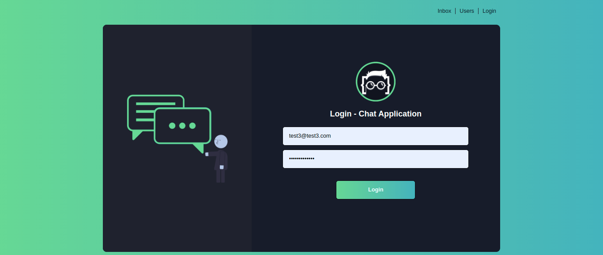
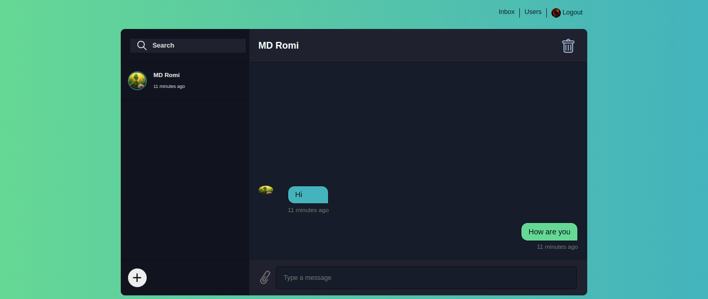
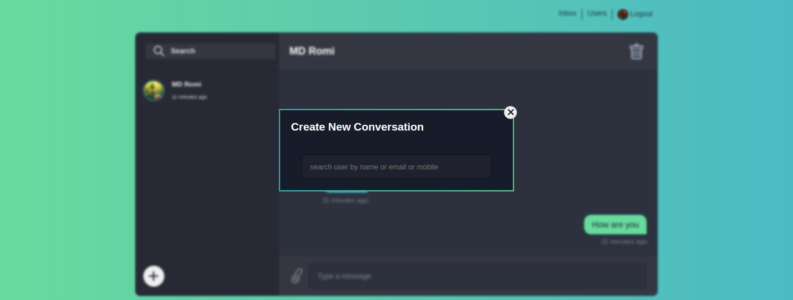

# [Chat Application LWS](https://www.youtube.com/playlist?list=PLHiZ4m8vCp9PHnOIT7gd30PCBoYCpGoQM)
Chat application with express.js and ejs template engine

## Development Tools
- Node and Express
- Ejs
- MongoDB
    - packages
    ``` json
    "dependencies": {
    "bcrypt": "^5.1.0",
    "cookie-parser": "^1.4.6",
    "dotenv": "^16.0.3",
    "ejs": "^3.1.8",
    "express": "^4.18.2",
    "express-validator": "^6.14.2",
    "http-errors": "^2.0.0",
    "jsonwebtoken": "^8.5.1",
    "moment": "^2.29.4",
    "mongoose": "^6.8.0",
    "multer": "^1.4.5-lts.1",
    "socket.io": "^4.5.4"
  }
    ```
## App Feature
__User Login__
<div align="center">
    
</div>

__Inbox Conversation__
<div align="center">
    
</div> 

__New Conversation__
<div align="center">
    
</div>

__Admin Can Create New User__
<div align="center">
    
</div>